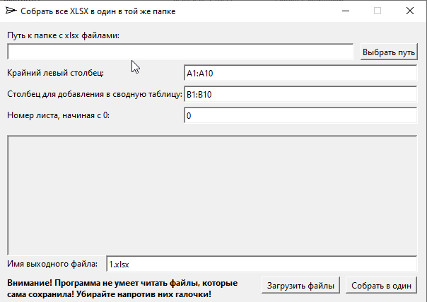

# CollectXLSX

Данная маленькая утилита написана с использованием xlnt и qt6. Её основная задача - объединять отдельные столбцы файлов xlsx в один общий файл. Есть консольный тестовый вариант программы и qt версия.

На будущее:

- к сожалению при чтении excel файлов xlnt, созданных самой xlnt происходит ошибка. В остальном программа работает. Версия xlnt 1.5.0

